# FC_ESC_STM32F405RG_26x26

### 1. Overview

All-in-One (AIO) circuit for quadcopter. STM32F405 is the main controller for FC and EFM8BB21 is the main controller for ESC. Screw hole dimension is 26x26 mm that compatible for almost tiny drone frame. 

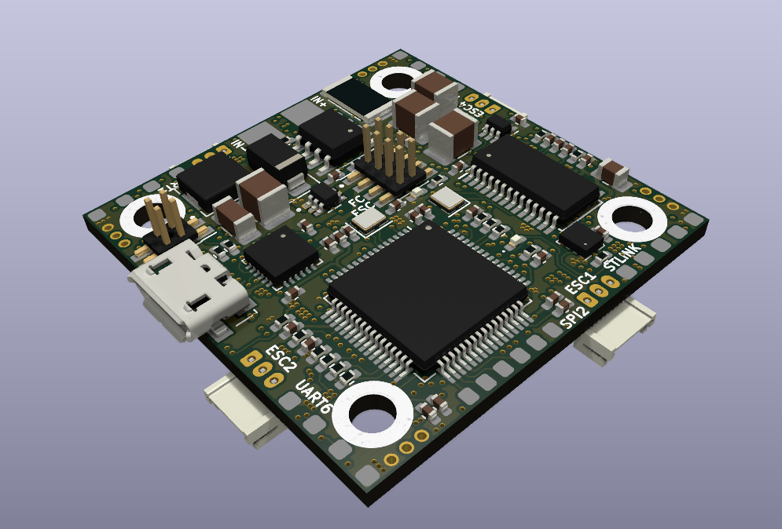

Everything about this board: Schematic, PCB gerber and BOM are free to distribute under open-source license for users.

### 2. Specifications

| Items               | Specifications                                               |
| ------------------- | ------------------------------------------------------------ |
| Power supply        | Pin LiPo 2-4 cell                                            |
| Microcontroller     | STM32F405RGT6 / 32-bit ARM Cortex-M4 with FPU(168MHz, 225DMIPS) |
| Sensors             | MPU6000 (3 axis gyroscope, 3 axis accelerometer)  BMP280 (barometer) INA186 (current) |
| Programmer          | JTAG/SWD connector                                           |
| Communicaton Ports  | UART x 4 I2C x 1 SPI x 1                           |
| OSD                 | Built-in AT7456                                              |
| LEDs and Buttons    | LED RED: 3V3 power on LED BLUE: User status             |
| Output power source | TPS5430 5V@5A RT9013 3V3@500mA                          |
| Dimensions          | 34 x34 mm Screw hole 26 x 26 mm                         |

**NOTE:**

This board use jumper to select 5V power source and to enable 3V3 power supply.

### 3. Layout / Pin map

| Function    | Pin                                                          |
| ----------- | ------------------------------------------------------------ |
| UART1       | PA9: TX PA10: RX                                        |
| UART3       | PB10: TX PB11: RX                                       |
| UART4       | PA0: TX PA1: RX                                         |
| UART6       | PC6: TX PC7: RX                                         |
| SPI2        | PB12: CS PB13: CLK PB14: MISO PB15: MOSI      |
| I2C2        | PB10: SCL PB11: SDA                                     |
| LED         | LED status: PB7 LED strip: PB6                          |
| BUZZER      | PC13                                                         |
| USB Port    | D-: PA11 D+: PA12                                       |
| Measurement | Current sens: PC1 Voltage sens: PC2 USB voltage sens: PC5 |

### 4. Hardware design

#### Schematic

[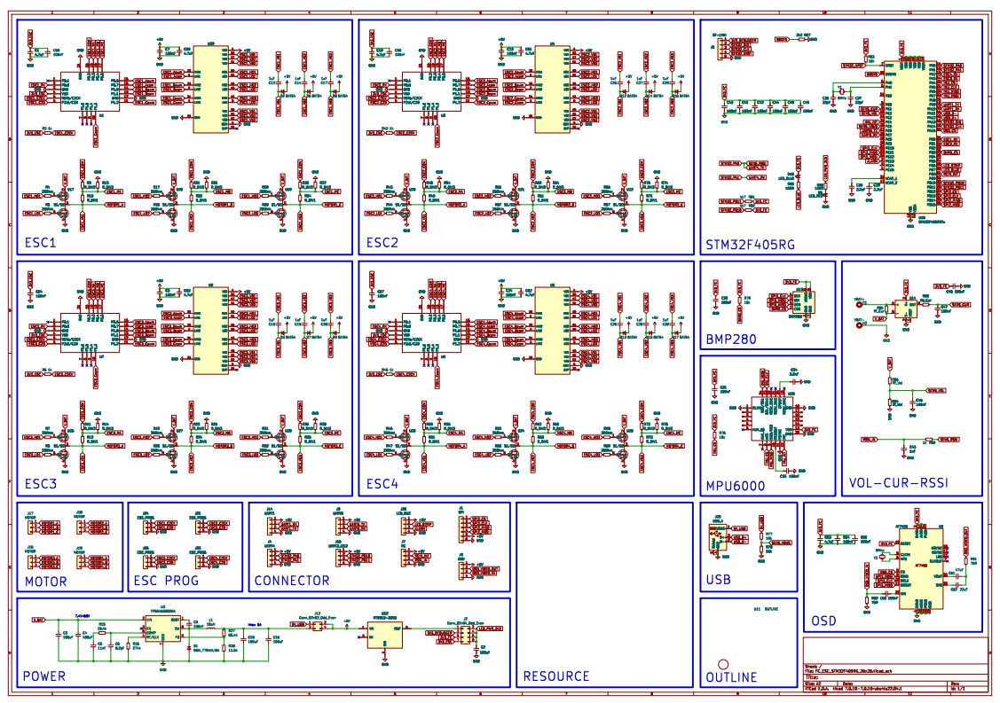](assets/demo/OpenDrone_AIO_FC_F405_HW_v1.pdf)

#### PCB F.Cu

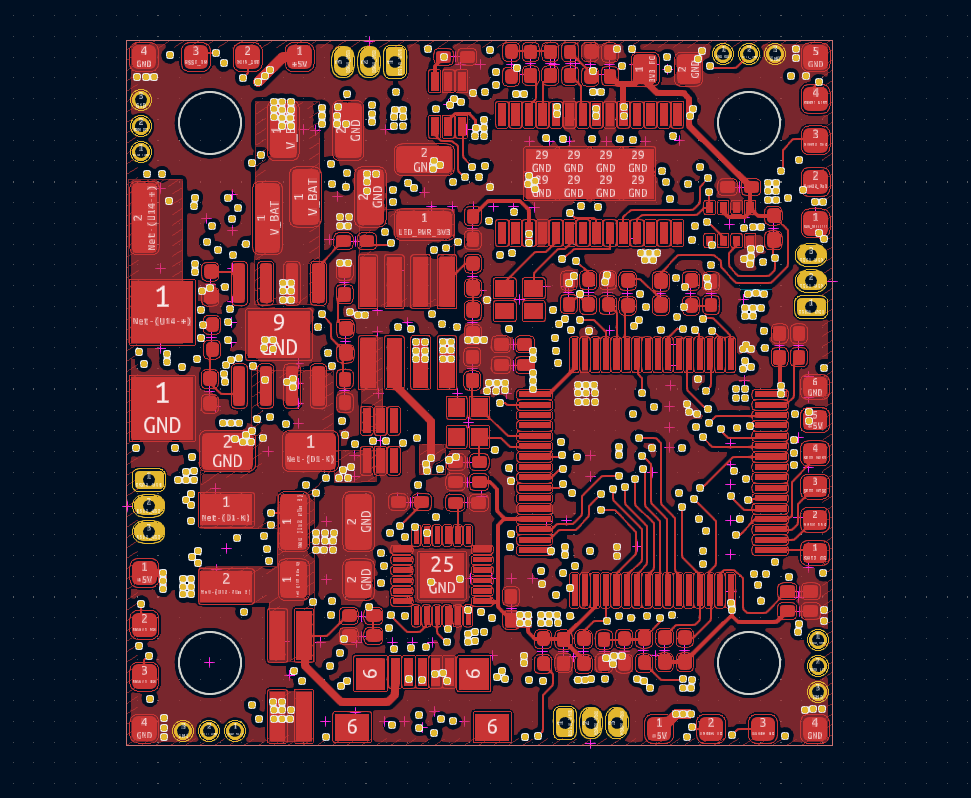

#### PCB In1.Cu

#### PCB In2.Cu

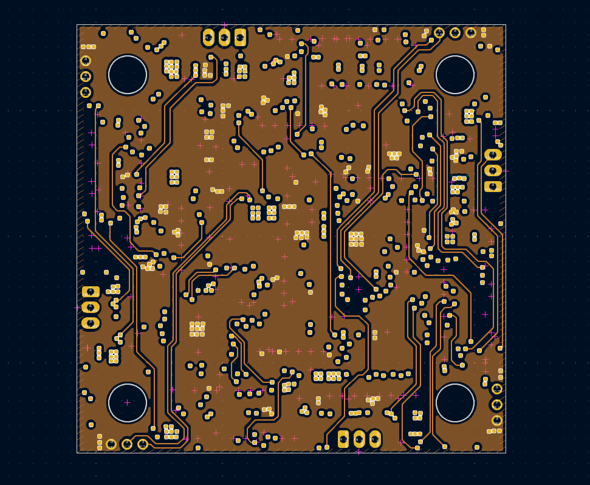

#### PCB In3.Cu

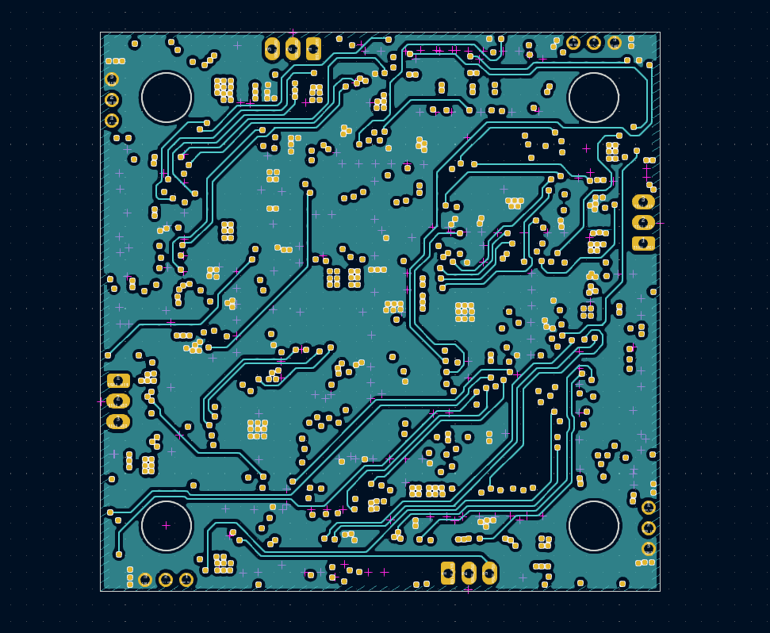

#### PCB In4.Cu

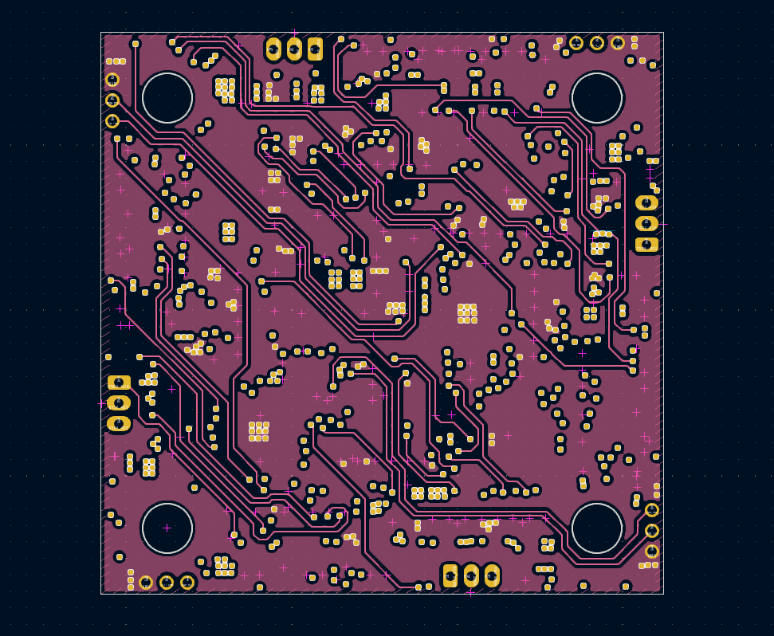

#### PCB In5.Cu

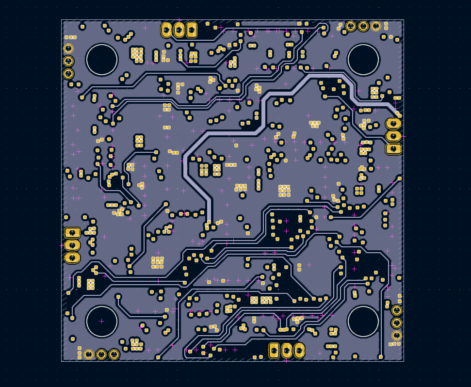

#### PCB In6.Cu

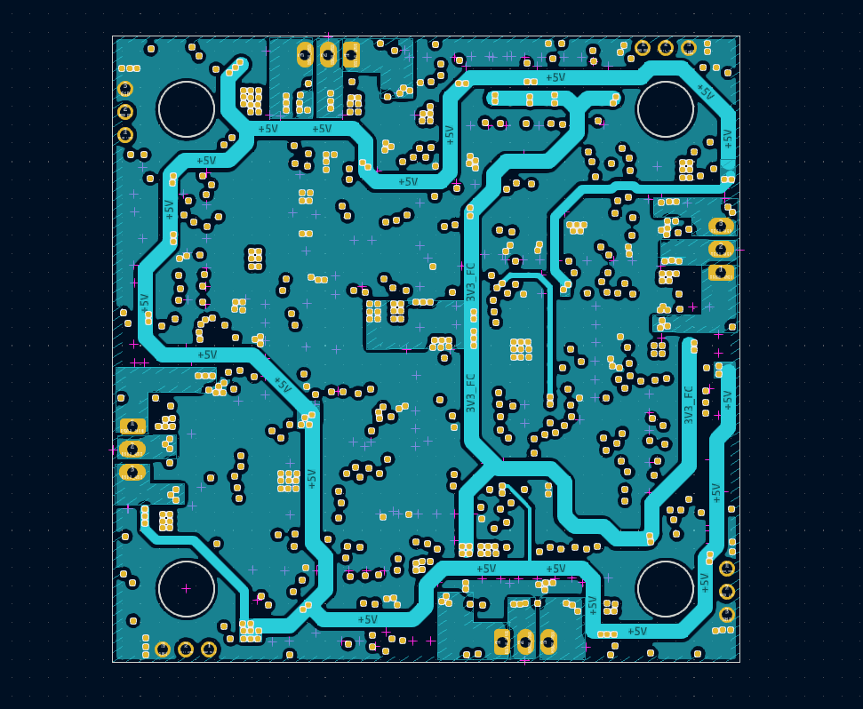

#### PCB B.Cu

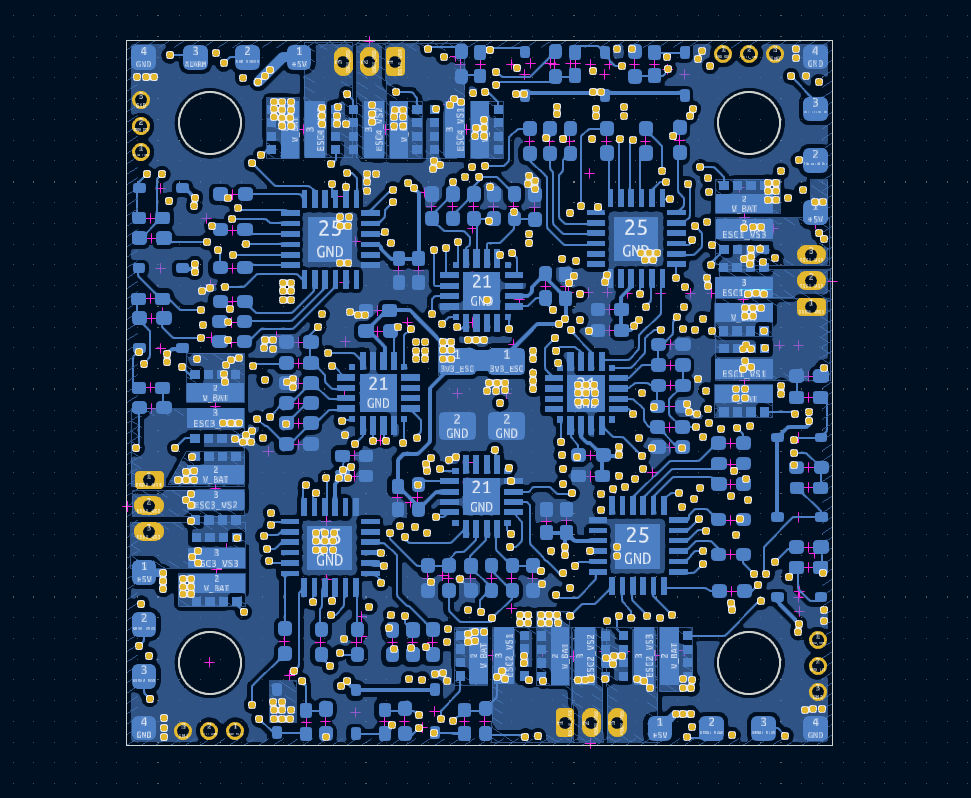

#### Dimension

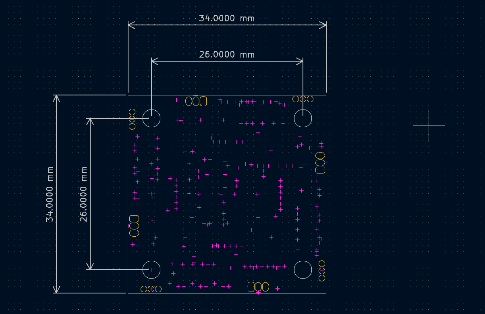

#### 3D Top

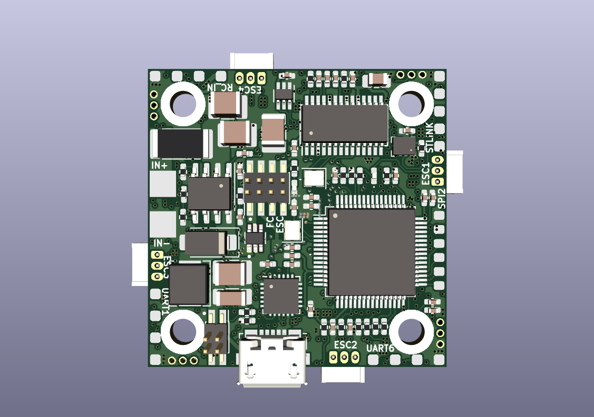

#### 3D Bot

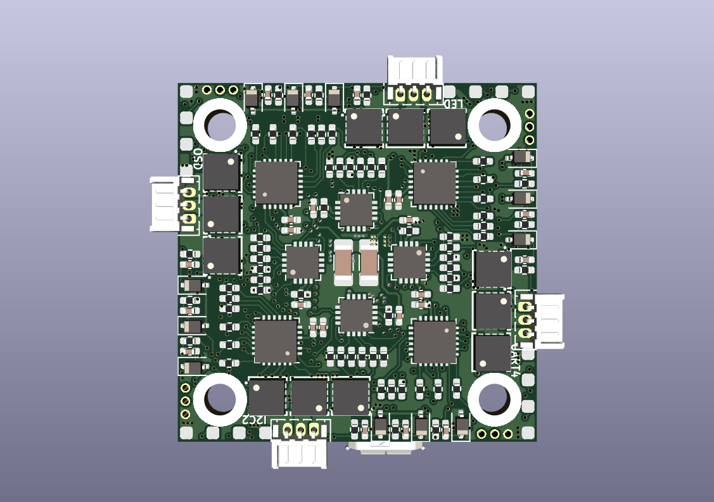

### 5. Bill of Materials (BOM)

### 6. Gerber
